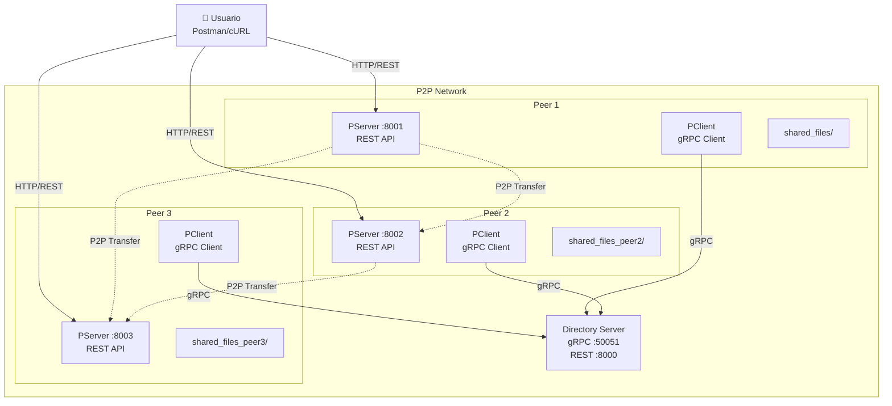

# 🔗 Sistema P2P File Sharing

Sistema distribuido de intercambio de archivos peer-to-peer con autenticación, API REST y arquitectura de microservicios basada en gRPC.


## 📋 Tabla de Contenidos

- [Características](#-características)
- [Arquitectura](#️-arquitectura)
- [Instalación](#️-instalación)
- [Uso Rápido](#-uso-rápido)
- [API Endpoints](#-api-endpoints)
- [Testing con Postman](#-testing-con-postman)
- [Configuración](#️-configuración)
- [Troubleshooting](#-troubleshooting)
- [Contribución](#-contribución)

## 🚀 Características

### ✨ Funcionalidades Principales
- **🔐 Autenticación Obligatoria**: Token-based authentication para todas las operaciones
- **🔍 Búsqueda Distribuida**: Buscar archivos en toda la red P2P
- **📤 Transferencias P2P**: Descarga directa entre peers sin servidor central
- **📁 Gestión de Archivos**: Upload, indexado automático y gestión de metadatos
- **🌐 API REST**: Interfaz HTTP simple y intuitiva
- **🐳 Docker Ready**: Despliegue completo con docker-compose
- **📊 Monitoreo**: Health checks y estadísticas en tiempo real

### 🏗️ Tecnologías Utilizadas
- **Backend**: Python 3.9, FastAPI, gRPC
- **Containerización**: Docker, Docker Compose
- **Protocolos**: HTTP/REST, gRPC, TCP
- **Autenticación**: JWT-like tokens, Bearer authentication
- **Testing**: Postman Collection incluida

## 🏛️ Arquitectura



### 🔄 Flujo de Datos
1. **Login**: Peer se autentica → Obtiene token de sesión
2. **Indexado**: Peer escanea archivos → Envía metadatos al Directory Server via gRPC  
3. **Búsqueda**: Cliente busca archivo → Directory Server retorna ubicaciones
4. **Descarga**: Cliente descarga directamente del peer que tiene el archivo

## 🛠️ Instalación

### Prerrequisitos
- 🐳 [Docker](https://www.docker.com/get-started) y Docker Compose
- 🔧 [Postman](https://www.postman.com/downloads/) (para testing)
- 🐍 Python 3.9+ (opcional, para desarrollo local)

### 1️⃣ Clonar el Repositorio
```bash
git clone <repository-url>
cd python-p2p
```

### 2️⃣ Desplegar con Docker
```bash
# Construir y ejecutar todos los servicios
docker-compose up --build

# En modo background (recomendado)
docker-compose up --build -d

# Ver logs en tiempo real
docker-compose logs -f
```

### 3️⃣ Verificar Despliegue
```bash
# Verificar que todos los contenedores estén corriendo
docker-compose ps

# Debería mostrar:
# ✅ p2p-directory-server (ports: 50051, 8000)
# ✅ p2p-peer1 (port: 8001) 
# ✅ p2p-peer2 (port: 8002)
# ✅ p2p-peer3 (port: 8003)
```

## 🚀 Uso Rápido

### 🔐 1. Autenticación (OBLIGATORIA)
```bash
# Login en Peer 1
curl -X POST "http://localhost:8001/login" \
  -H "Content-Type: application/json" \
  -d '{
    "peer_id": "peer1",
    "username": "usuario1", 
    "password": "password1"
  }'

# Respuesta: guarda el "token" para siguientes requests
```

### 🔍 2. Buscar Archivos
```bash
# Buscar archivos en toda la red P2P
curl -X POST "http://localhost:8001/search" \
  -H "Content-Type: application/json" \
  -H "Authorization: Bearer <tu-token>" \
  -d '{
    "query": "documento"
  }'
```

### 📥 3. Descargar Archivo
```bash
# Descargar archivo desde otro peer
curl -X GET "http://localhost:8002/download/documento_peer2.txt" \
  -H "Authorization: Bearer <token-del-peer2>" \
  -o "archivo_descargado.txt"
```

### 📤 4. Subir Archivo
```bash
# Subir archivo a tu peer
curl -X POST "http://localhost:8001/create" \
  -H "Authorization: Bearer <tu-token>" \
  -F "file=@mi_archivo.txt"
```

## 📚 API Endpoints

### 🔓 Endpoints Públicos
| Método | Endpoint | Descripción |
|--------|----------|-------------|
| `GET` | `/health` | Health check del peer |
| `POST` | `/login` | Autenticación del peer |

### 🔒 Endpoints Protegidos (requieren token)
| Método | Endpoint | Descripción |
|--------|----------|-------------|
| `POST` | `/search` | Buscar archivos en la red P2P |
| `GET` | `/download/{filename}` | Descargar archivo específico |
| `POST` | `/create` | Subir archivo (multipart/form-data) |
| `POST` | `/logout` | Cerrar sesión |

### 🌐 Puertos y Servicios
| Servicio | Puerto | Protocolo | Descripción |
|----------|--------|-----------|-------------|
| Directory Server | 50051 | gRPC | Servidor central de directorio |
| Directory Server | 8000 | HTTP | API REST del servidor |
| Peer 1 | 8001 | HTTP | API REST del peer 1 |
| Peer 2 | 8002 | HTTP | API REST del peer 2 |
| Peer 3 | 8003 | HTTP | API REST del peer 3 |

## 🧪 Testing con Postman

### 📦 Importar Colección
1. Abrir Postman
2. **Import** → **Upload Files**
3. Seleccionar `Sistema P2P - Proyecto 1 Telematica.postman_collection.json`

### 🎯 Flujo de Testing Recomendado

#### 1️⃣ Setup Inicial
```bash
# 1. Health Check (todos los peers)
GET http://localhost:8001/health
GET http://localhost:8002/health  
GET http://localhost:8003/health

# 2. Login en todos los peers
POST http://localhost:8001/login  # Peer 1
POST http://localhost:8002/login  # Peer 2
POST http://localhost:8003/login  # Peer 3
```

#### 2️⃣ Testing Búsquedas
```bash
# Buscar archivos desde cualquier peer loggeado
POST http://localhost:8001/search
{
  "query": "documento"
}
```

#### 3️⃣ Testing Descargas Cross-Peer
```bash
# Descargar archivo que está en peer2 desde peer1
GET http://localhost:8002/download/documento_peer2.txt
Authorization: Bearer <token-del-peer2>
```

### 🔑 Credenciales de Testing

| Peer | Puerto | Username | Password | Archivos |
|------|--------|----------|----------|----------|
| peer1 | 8001 | usuario1 | password1 | 6 archivos |
| peer2 | 8002 | usuario2 | password2 | 4 archivos |
| peer3 | 8003 | usuario3 | password3 | 2 archivos |

## ⚙️ Configuración

### 🐳 Variables de Entorno (Docker)
```env
# Configuración del Peer
PEER_ID=peer1
PEER_USERNAME=usuario1
PEER_PASSWORD=password1
PEER_HOST=0.0.0.0
PEER_REST_PORT=8001

# Configuración de Red
SERVER_URL=directory-server:50051

# Configuración de Archivos
SHARED_DIRECTORY=/app/shared_files
```

### 📄 Configuración Local (config.json)
```json
{
  "peer": {
    "peer_id": "peer1",
    "username": "usuario1",
    "password": "password1"
  },
  "network": {
    "host": "localhost", 
    "rest_port": 8001,
    "server_url": "localhost:50051"
  },
  "files": {
    "shared_directory": "./shared_files",
    "allowed_extensions": [".txt", ".json", ".py", ".md", ".log"],
    "max_file_size_mb": 100
  },
  "logging": {
    "level": "INFO",
    "file": "peer_app.log"
  }
}
```

## 🐛 Troubleshooting

### 🔍 Diagnóstico Común

#### ❌ Peer no responde
```bash
# Verificar contenedores
docker-compose ps

# Ver logs específicos
docker-compose logs peer1 --tail=20

# Reiniciar servicio
docker-compose restart peer1
```

#### ❌ Error 401: Unauthorized
- ✅ Verificar que hiciste login correctamente
- ✅ Confirmar formato del header: `Authorization: Bearer <token>`
- ✅ Verificar que el token no haya expirado
- ✅ Usar el token del peer correcto para descargas

#### ❌ Búsquedas vacías
```bash
# Verificar que los peers estén loggeados e indexados
docker-compose logs directory-server --tail=10

# Re-login en todos los peers para reindexar
curl -X POST http://localhost:8001/login ...
curl -X POST http://localhost:8002/login ...
curl -X POST http://localhost:8003/login ...
```

#### ❌ Error de conexión al Directory Server
```bash
# Reiniciar stack completo
docker-compose down
docker-compose up --build -d

# Verificar logs del servidor
docker-compose logs directory-server
```

### 📊 Comandos de Monitoreo
```bash
# Estado general del sistema
docker-compose ps

# Logs en tiempo real
docker-compose logs -f

# Recursos utilizados
docker stats

# Limpiar sistema (¡CUIDADO!)
docker-compose down -v
docker system prune -f
```

## 🎯 Casos de Uso Ejemplo

### 📋 Escenario 1: Usuario Busca y Descarga
```bash
# 1. Login como usuario del peer1
POST /login → Obtener token_peer1

# 2. Buscar archivos de "documento"  
POST /search → Encontrar "documento_peer2.txt" en peer2

# 3. Login en peer2 para obtener su token
POST http://localhost:8002/login → Obtener token_peer2

# 4. Descargar archivo desde peer2
GET http://localhost:8002/download/documento_peer2.txt
Authorization: Bearer token_peer2
```

### 📋 Escenario 2: Upload y Compartir
```bash
# 1. Login en peer1
POST /login → token_peer1

# 2. Subir archivo nuevo
POST /create con archivo → Indexado automático

# 3. Otros peers pueden encontrarlo
POST /search desde peer2 → Encuentra archivo en peer1

# 4. Descarga desde otros peers  
GET http://localhost:8001/download/nuevo_archivo.txt
Authorization: Bearer token_peer1
```

## 🤝 Contribución

### 🛡️ Estándares de Código
- 🐍 Python 3.9+
- 📏 PEP 8 compliance
- 🧪 Tests incluidos
- 📚 Documentación en código
- 🐳 Docker-first development

### 🔄 Workflow de Desarrollo
1. **Fork** el repositorio
2. **Clone** tu fork localmente
3. **Crea** una rama feature: `git checkout -b feature/nueva-funcionalidad`
4. **Desarrolla** y **prueba** tus cambios
5. **Commit**: `git commit -m "Add: nueva funcionalidad"`
6. **Push**: `git push origin feature/nueva-funcionalidad`
7. **Pull Request** con descripción detallada

### 🧪 Testing Local
```bash
# Ejecutar tests locales
python -m pytest tests/

# Verificar con Docker
docker-compose -f docker-compose.test.yml up --build
```

## 📄 Licencia

Este proyecto está bajo la Licencia MIT. Ver el archivo [LICENSE](LICENSE) para más detalles.

## 👥 Equipo

- **Desarrollador Principal**: [Tu Nombre]
- **Arquitectura**: Sistema P2P distribuido
- **Stack**: Python, FastAPI, gRPC, Docker

---

## 🔗 Enlaces Útiles

- 🌐 **Peer 1 API**: http://localhost:8001
- 🌐 **Peer 2 API**: http://localhost:8002
- 🌐 **Peer 3 API**: http://localhost:8003
- 🌐 **Directory Server**: http://localhost:8000
- 📚 **Documentación API**: http://localhost:8001/docs (Swagger)
- 🧪 **Postman Collection**: `postman_collection.json`

---

<div align="center">

**¡Sistema P2P listo para producción!** 🚀

[⬆️ Volver al inicio](#-sistema-p2p-file-sharing)

</div>